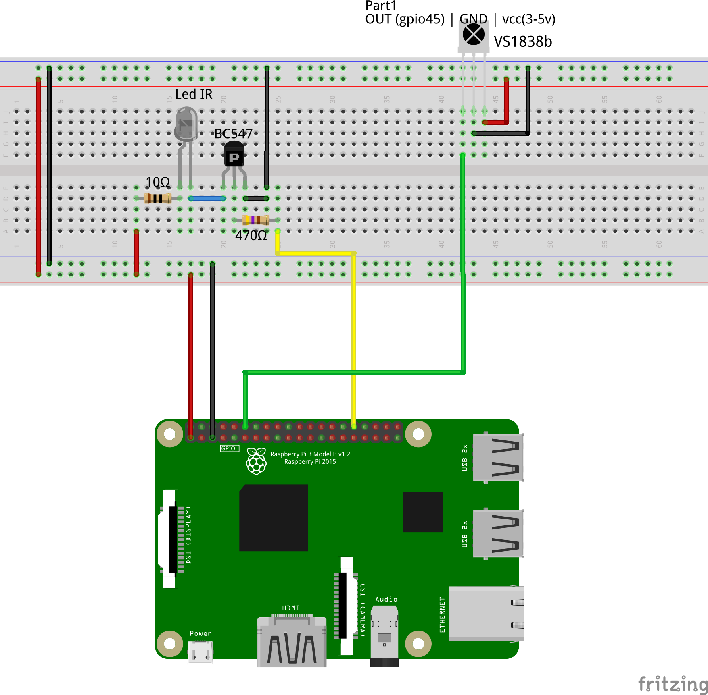
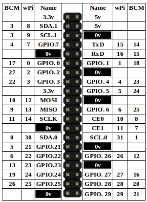

[//]: <> (Copyright [C] 2020 Jeff Pal. All rights reserved.)

# Infrared-codec

Infrared-codec is a Raspberry PI algorithm in C which encodes and decodes infrared digital signals for device remote controls as TV and arconditioner.
This program has two main functions:

- reads an IR sensor **IR VS1838b** and gerenate a raw code within a file;
- encode a raw data and emit it through the IR emitter to the target device.

### Project schema



### Base Leaf



# Build

```
make all
```

# Reading and recording an IR signal

```
sudo ./sendRaw ../resources/elgin_airconditioner/1.cnf
```

# Emit an IR command

```
sudo ./readIR
```